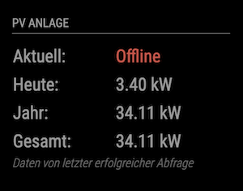

# MMM-Fronius2

This is a module for the [MagicMirror²](https://github.com/MichMich/MagicMirror/).

This module shows live data from a Fronius power converter (and more). There are already MM modules that show live data from Fronius power converters (hence the name), but they were lacking various features that I needed (see About section). So I decided to do my own implemetation.

## About

The module has the following features:

* Show live data of the power converter
* Detect offline converter and show last fetched data
* Send power data to [MMM-EnergyMonitor](https://github.com/deg0nz/MMM-EnergyMonitor) (see below)

## Status

The current development status of this module is: **maintained**

This means: I'm open for feature requests, pull requests, bug reports, ...

## Screenshots

Offline converter:



## Using the module

To use this module, add the following configuration block to the modules array in the `config/config.js` file:

```js
var config = {
    modules: [
        {
            module: 'MMM-Fronius2',
            config: {
                ip: "192.168.1.12", // Entering the IP of the power converter is mandatory
            }
        }
    ]
}
```

## Configuration options

Please refer to [MMM-Fronius2 default configuration](MMM-Fronius2.js) to prevent syntax errors.

| Option           | Description
|----------------- |-----------
| `ip`             | *Required* The IP address if your power conferter
| `updateInterval` | *Optional* How often should the data be updated <br><br>**Type:** `int` (milliseconds) <br>Default: `3000` milliseconds (3 seconds)
| `wattConversionOptions` | *Optional* Configures if and how Watts should ge converted to kW, mW, gW <br><br>**Type:** `object` <br>See configuration below
| `wattConversionOptions`.`enabled` | *Optional* Turns the feature on/off <br><br>**Type:** `boolean` (on/off)<br>Default: `true` (on)
| `wattConversionOptions`.`threshold` | *Optional* At which value should numbers be converted <br><br>**Type:** `int` (Watt) <br>Default: `1200` Watt
| `wattConversionOptions`.`numDecimalDigits` | *Optional* To how many decimal digits should the converted value be shortened (keep this value low to prevent UI glitches) <br><br>**Type:** `int` <br>Default: `2` (example: 1.45 kW)
| `offlineDetectionOptions` | *Optional* Configures the offline detection of the power converter (for converters that are configured to turn off at night) <br><br>**Type:** `object` <br>See configuration below
| `offlineDetectionOptions`.`numRequests` | *Optional* The number of failed requests from which the converter should be considered offline<br><br>**Type:** `int` <br>Default: `5`
| `offlineDetectionOptions`.`offlineInterval` | *Optional* The fetch interval for an offline converter<br><br>**Type:** `int` (millisecnods) <br>Default: `1800000` (30 Minutes)
| `requestTimeout` | *Optional* When should a request considered to be timed out <br><br>**Type:** `int` (milliseconds) <br>Default: `1000` milliseconds (1 second)
| `broadcastSolarPower` | *Optional* Should solar power data be broadcasted to [MMM-EnergyMonitor](https://github.com/deg0nz/MMM-EnergyMonitor) <br><br>**Type:** `boolean` (on/off)<br>Default: `false` off
| `broadcastGridPower` | *Optional* Should grid power data be broadcasted to [MMM-EnergyMonitor](https://github.com/deg0nz/MMM-EnergyMonitor) <br><br>**Type:** `boolean` (on/off)<br>Default: `false` off
| `broadcastBatteryPower` | *Optional* Should battery power data be broadcasted to [MMM-EnergyMonitor](https://github.com/deg0nz/MMM-EnergyMonitor) <br><br>**Type:** `boolean` (on/off)<br>Default: `false` off

## Special Thanks

* [MichMich](https://github.com/MichMich) for creating the Magic Mirror Project
* [hukl](http://smyck.net) for creating the [SMYCK color theme](http://color.smyck.org) on which the default colors are based

## Issues

If you find any problems, bugs or have questions, please open a [GitHub issue](https://github.com/deg0nz/MMM-EnergyMonitor/issues) in this repository.

## Disclaimer

All product and company names are trademarks™ or registered® trademarks of their respective holders. Use of them does not imply any affiliation with or endorsement by them. 
